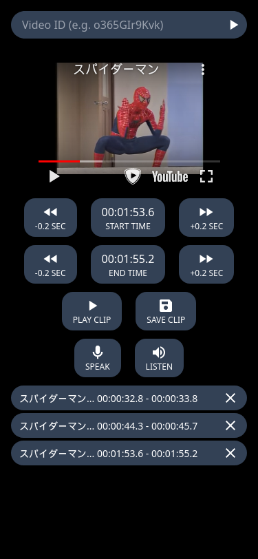
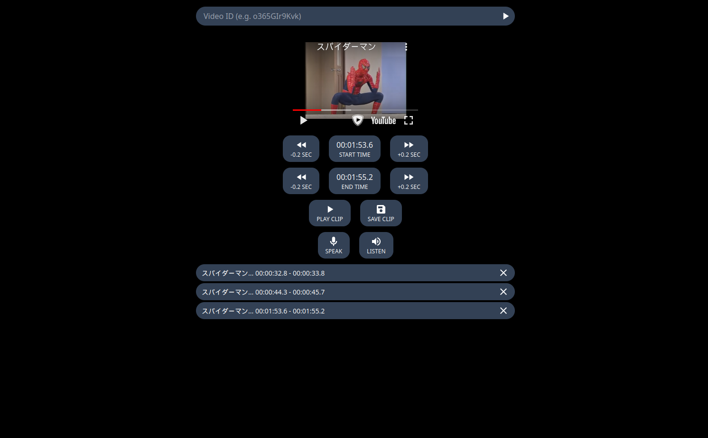

# Speaking Practice

https://speaking-practice.vercel.app

Save YouTube video clips and record yourself trying to sound like the speaker. The goal of this web app is to help you improve your speaking ability in a foreign language.

This web app was built with [React](https://react.dev/), [TypeScript](https://www.typescriptlang.org/), [Next.js](https://nextjs.org/), and [Tailwind](https://tailwindcss.com/). I used [create-t3-app](https://github.com/t3-oss/create-t3-app) to initialize the project.

## Possible ways to use this web app

- Save your favorite clips from YouTube videos and improve your accent by recording yourself and listening to the differences.
- Learn how to sing a song by saving clips and practicing those parts.
- Shadow your favorite YouTubers and save the difficult parts so you can practice them later.

## Screenshots

 

